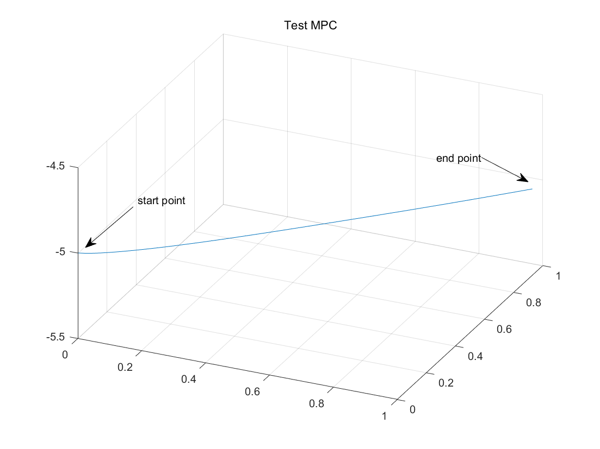

# drone_mpc

**Nonlinear Model Predictive Control (NMPC) for Drone**. This implementation is based on acados and inspired by [A Comparative Study of Nonlinear MPC and Differential-Flatness-Based Control for Quadrotor Agile Flight](http://arxiv.org/abs/2109.01365). The visualization is done using **MATLAB** as shown below:

<p align="center">
  
</p>

## 1. Installation

1. Install **acados** and its dependencies, refer to the [acados official documentation](https://docs.acados.org/installation/index.html).

2. Clone this repository:
    ```bash
    git clone https://github.com/KafuuChikai/drone_mpc.git
    cd drone_mpc
    ```

## 2. Directory Structure

- `drone_opt.py`: Contains the implementation of the drone optimizer.
- `drone_model.py`: Contains the definition of the drone model.

## 3. Usage

Run the optimizer:
```bash
python drone_opt.py
```
After running `drone_opt.py`, the drone state and control data files `drone_state.csv` and `drone_control.csv` will be generated.

## 4. Visualization

1. Use the MATLAB script `/data_test/data_show.m` for visualization.

2. First, import the position state from `drone_state.csv` as a variable `p` (shape `time_step x 3`).

3. Then, run `data_show.m` in MATLAB to visualize the results.